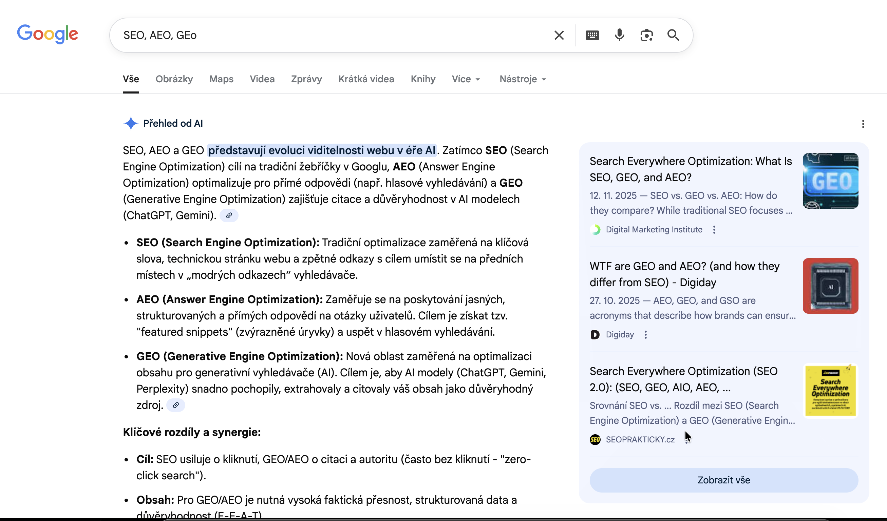

Jak funguje vyhledávání v roce 2026? Není GEO a AEO jen FOMO?
Jak funguje vyhledávač v době AI?

SEO (Search Engine Optimization) je velice důležitá věc, aby váš web našli uživatelé pomocí vyhledávaču (Seznam, Google, Microsoft Bing atd.).
GEO (Generative Engine Optimization) a AEO (AI Engine Optimization) jsou novější termíny, které se objevily s nástupem umělé inteligence a generativních modelů, jako je ChatGPT, Bard a další.

V nové éře vyhledávání je čím dál více časté to, že když uživatel chce najít určitý výsledek. Dostane odpověď přímo na stránce výsledků vyhledávání aniž by musel kliknout na jakýkoliv odkaz.
Toto je známé jako "zero-click search" (vyhledávání bez kliknutí). Většinou se jedná o jednoduché dotazy jako definice slov, určité vlastnosti produktu, vysvětlení znalostí atd.
Co to znamená? Že uživatelé nemusí navštívit váš web, aby získali odpověď, kterou hledají. Místo toho dostanou odpověď přímo na stránce výsledků vyhledávání.

<em>Vyhledávání významu slov v Google vyhledávači a ukázka AI shrnutí</em>

S nástupem AEO a GEO jsou pokusy vytvořit nějaký standard, který by jasně definoval, jak AI boti (ChatGPT, Claude, Gemini, Microsoft Copilot atd.) budou "číst" a zacházet s obsahem.
Takovým příkladem je soubor llms.txt (<a href="https://llmstxt.org/" rel="nofollow noreferrer noopener" target="_blank">llmstxt.org</a>),
který může být umístěn na webu a který říká AI modelům, jak mají zacházet s obsahem na daném webu. Jedná se zatím o pokus
vytvořit standard.

Je tohle ta cesta v roce 2026? Možná. Pořád si myslím, že z pohledu SEO je důležitější mít kvalitní obsah a
dobře strukturovaný pomocí nejnovějších technik - JSON-LD ([více o JSON-LD](/clanky/proc-pouzivat-json-ld-na-webu-a-jak-vznikl/)).

## Odkazy

- <a href="https://searchengineland.com/seo-2026-stay-same-467688" rel="nofollow noreferrer noopener" target="_blank">SEO in 2026: What will stay the same</a>
- <a href="https://searchengineland.com/guide/zero-click-searches" rel="nofollow noreferrer noopener" target="_blank">Zero-click search: The search revolution transforming digital marketing</a>
- <a href="https://seranking.com/blog/llms-txt/" rel="nofollow noreferrer noopener" target="_blank">Does LLMs.txt impact your AI visibility and citations? No, according to research</a>